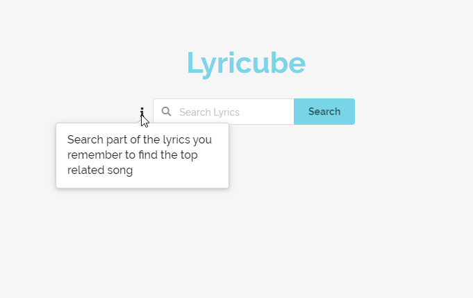
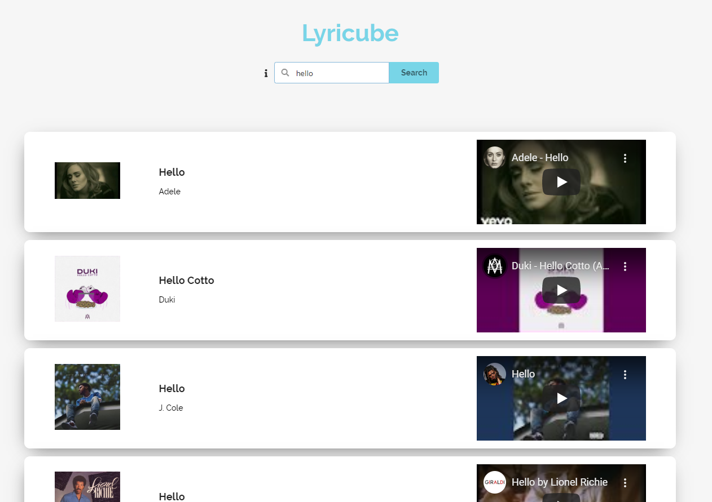
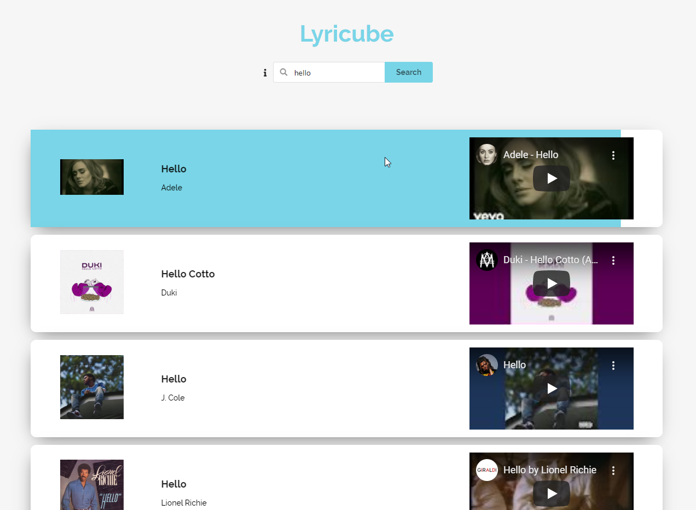
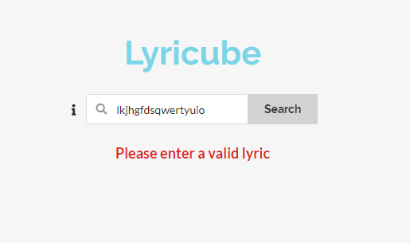
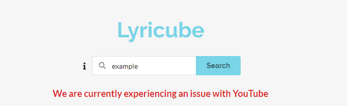
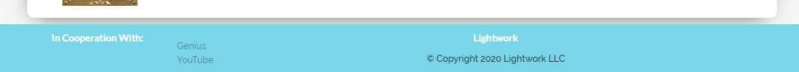
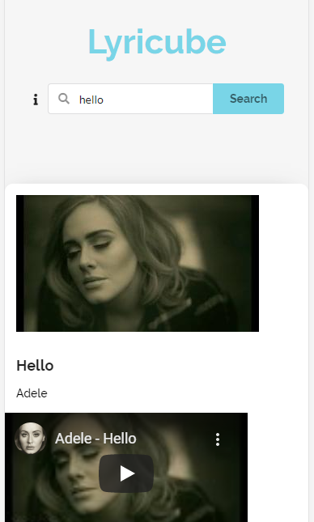
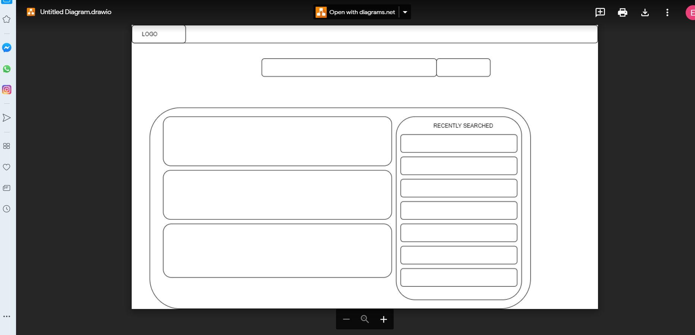

# The Lyricube app Brought to you by Lightwork

Sometimes you have a song stuck in your head or even after hearing a song you like but can't figure out who it's by or what the song's called. The Lyricube app allows the user to search part of the lyrics that they remember to populate the most popular songs with the lyrics entered as well as a YouTube video for ease of use.

## Technicalities:

For the creation of the app, we used:
- [Draw IO](https://app.diagrams.net): This allowed us to draw up a sketch of how each of us visualised our design and merge each idea into one (see image 8: design)
- [Genius API](https://genius.com/developers): which allows us to input lyrics and returns popular songs that contain those lyrics.
- [YouTube API](https://developers.google.com/youtube): which allows us to input the song titles and artist names received and returns the top related videos for each song.
- [Rapid API](https://rapidapi.com/): Due to a CORS issue we encountered through the Genius API, we had to use Rapid API to bypass this issue.

For the styling of the application we used:
- [Semantic-UI](https://semantic-ui.com/): the core CSS framework for the styling, from buttons to layouts and popups.
- [Hover CSS](https://ianlunn.github.io/Hover/): this allowed us to animate the page in a simple yet effective way to grab the users attention by allowing the user to highlight the selected results by hovering over the area.
- [Google Fonts](https://fonts.google.com/): this had a larger library of font families to choose from as we weren't happy with the exiting font family range within Semantic-UI

## Project management

To manage the project we initially went with [Trello](https://trello.com) due to it's simplicity and ease of use however after researching some more we decided to use [Asana](https://app.asana.com/0/1174159538731249/board) as this allowed us to enter subtasks within each task (which wasn't possible on trello or several other products) to make the board cleaner and allowed us to tick off each one before completing the overriding task. It also kept the core functionalities of the other project management tools such as naming each section of tasks, appointing tasks to select individuals and setting a completion date.

## Functionality of the app:
- When the user hovers over the information icon, they are presented with how to get started with the app (see image 1: tooltip)
- When a user inputs a valid set of lyrics the app will send the lyrics to the Genius api to look for the most popular songs containing those lyrics
- Once the songs have been found and returned, Lyricube then selects the top 5 results and sends them off to the YouTube api to get the most related videos for each song
- Once all the information is gathered Lyricube populates the top 5 results with the single/album cover on the left, song title and artists in the middle and a playable YouTube video on the right (see image 2: results)
- When the user searches for different lyrics, the existing results are removed to present the new set of results
- When you hover over the search result, the results box animates is highlighted with a blue swipe animation (see image 3: highlighted results)
- If the input from the user is invalid or there is no search results, the user will be prompted to try again with valid lyrics (see image 4: lyrics error)
- To create a smooth experience, if the user clicks more than once to search, the app will only render the results once
- If there is an issue with returning results from the YouTube api, the user will be presented with a different error message to notify this. (see image 5: YouTube error)
- The user is presented with the opportunity to find out more about the apis used through the sticky footer that's generated at the bottom of the page (see image 6: footer)
- When the user is searching through a mobile media, the information is displayed vertically instead of horizontally (see image 7: mobile view)

## Problems encountered

- The initial startup of everything was quite slow due to not being able to meetup in person and having to take turns talking in a online meeting room however we quickly adapted to this and had one individual drive (for writing the code or drawing the designs) and the others would take turns navigating (going into detail what to input in the designs and code)
- When looking into the APIs we had a few ideas generated however with alot of them there were limitations to how much of their database we could access without paying a premium, before choosing the Genius API for the lyrics search function, we initially planned to use [MusixMatch](https://developer.musixmatch.com) however we only had access to 30% of their library without paying a premium.
- When choosing the CSS framework we initially decided on [Tailwind CSS](https://tailwindcss.com) due to it's flexibility and smooth designs however when we started to implement it, we found that the documentation was very vague and did not provide much instructions on how to implement each styling change. After more research we decided to use [Semantic-UI](https://semantic-ui.com) instead which had more thorough documentation however as it isn't as flexible as Tailwind without having to manually code some styling parts, we had to compromise slightly on our designs to fit into it.
- During the implementation of the Genius API, we encountered a CORS issue which prevented us from connecting to the API from a local domain. We decided to use Rapid API to bypass this as Rapid API acted as a proxy in which we pulled the information from instead.
- After implementing both APIs, we encountered a Racing Condition where the YouTube API would try to fetch the information before the the Genius API had successfully returned the song information therefore the YouTube API would return back empty results. To resolve this we made sure that the Youtube API only runs after the promise of the Genius API had returned by isolating certain functionalities and moving them around. 
- Due to the time constraints we weren't able to implement some of our initial ideas however we've decided that they would still be useful functionalities and have placed them in the future development section

## Successes
-We were impressed with how easily we were able to move from our white-boarding and wire-framing, to implementing individual functional
task elements.
​
-We were very happy about how we were able to 'chunk-down' the individual task elements, and then fit them together like a puzzle!
​
-We were successfully able to communicate and collaborate outside of classroom hours, by using technologies such as 'Asana', 'Zoom' and "Whats app".

## Future Development
- Voice search functionality
- Sidebar that shows search history
- Incorporate more of the information received to allow the user to see more information about the song such as movies the song has featured in

## Image Examples

Image 1: tooltip 

Image 2: results 

Image 3: highlighted results 

image 4: lyrics error 

Image 5: YouTube error 

Image 6: footer 

Image 7: mobile view 

Image 8: design

## Resources 
- DrawIO: [https://app.diagrams.net](https://app.diagrams.net)
- Genius API: [https://genius.com/developers](https://genius.com/developers)
- YouTube API: [https://developers.google.com/youtube](https://developers.google.com/youtube)
- Rapid API: [https://rapidapi.com/](https://rapidapi.com)
- Semantic-UI: [https://semantic-ui.com/](https://semantic-ui.com)
- Hover.css: [https://fonts.google.com](https://fonts.google.com)
- Asana: [https://app.asana.com](https://app.asana.com)
